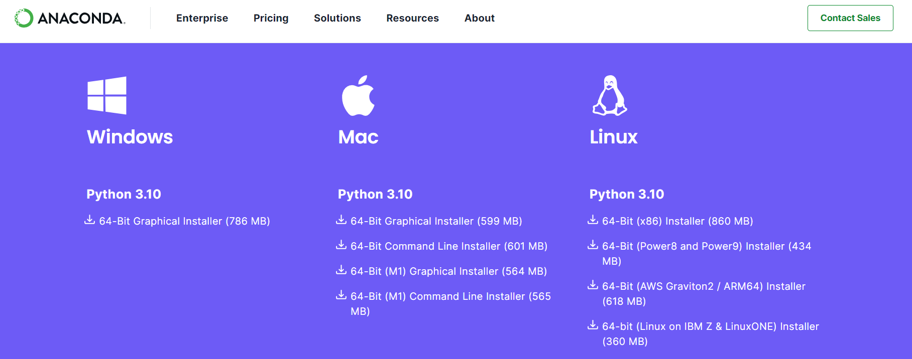
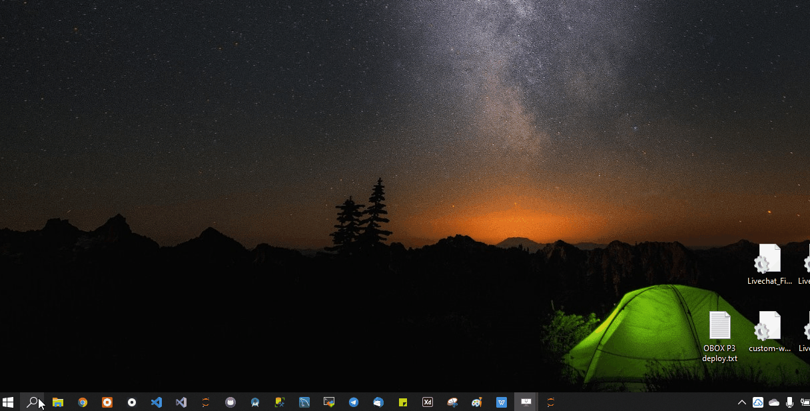
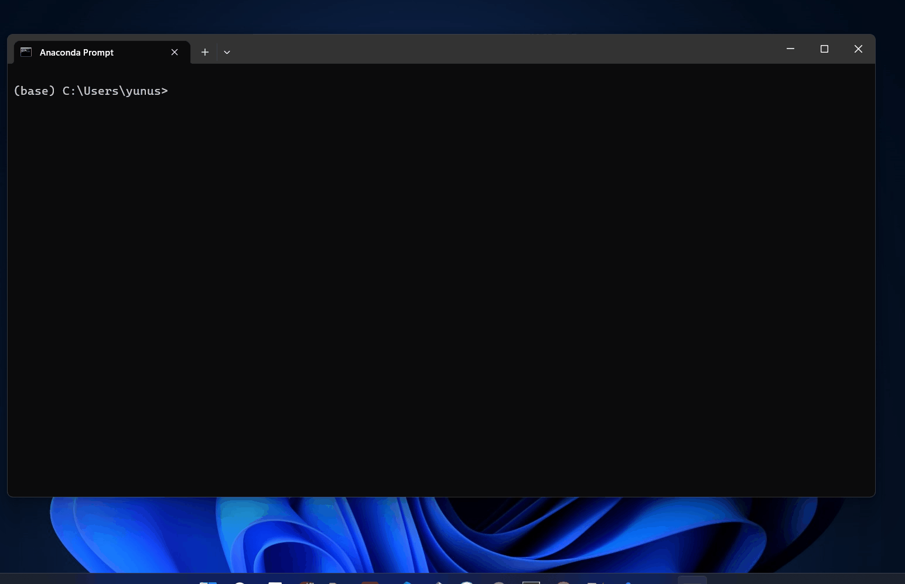
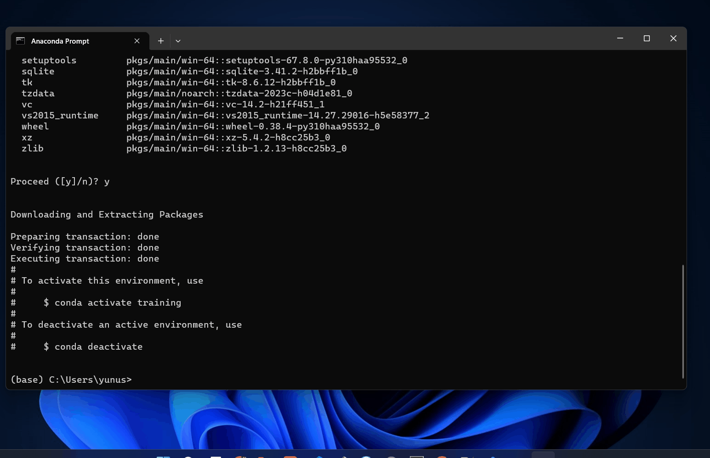
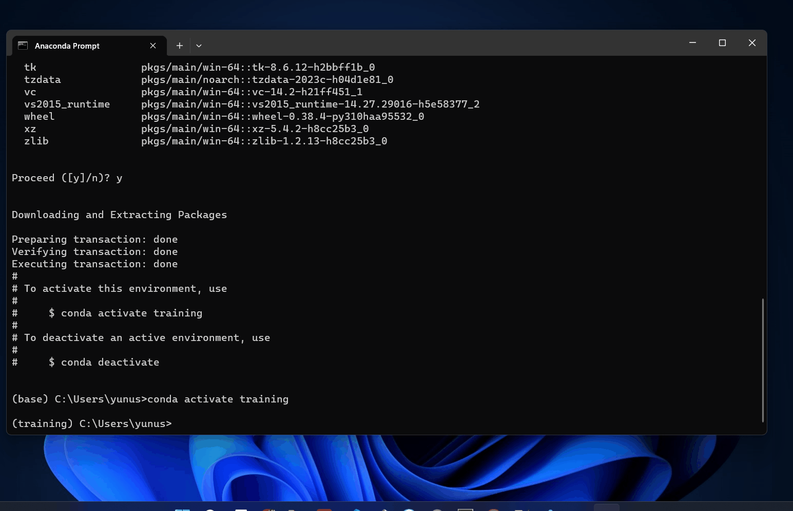

# Preparation 
### 1. Install Anaconda 3
- Download Anaconda 3 dari [link ini](https://www.anaconda.com/download) (*scroll ke bagian paling bawah*), <br>
</img>
- Pilih `Windows > Python 3.10 > 64-Bit Graphical Installer (786 MB)`,
- Lalu install di komuter yang akan kita gunakan.

### 2. Setup Conda Environment
- buka Anaconda Prompt,<br>
</img>
- Setelah itu buat environment baru dengan nama `training` dengan versi `python 3.10`,<br>
</img>
```
conda create --name training python=3.10
```
- Activate environment,<br>
</img>
```
conda activate training
```
- Check versi Python yang digunakan, pada anaconda prompt buka [python REPL](https://en.wikipedia.org/wiki/Read%E2%80%93eval%E2%80%93print_loop),<br>
</img>
```
python
```
- telihat jika versi python yang digunakan adalah `python 3.10.x`,
- untuk close dari python klik `CTRL + Z`, lanjutkan dengan klik `ENTER`.

### 3. Install Library
- Masih menggunakan anaconda promt, pastikan sudah activate environment `training`,
- Install Numpy Library,
```
conda install numpy
```
- Install OpenCV,
```
conda install -c conda-forge opencv
```
- Install PySimpleGUI,
```
conda install -c conda-forge pysimplegui
```
### 4. Check Library
- Masih menggunakan anaconda promt, pastikan sudah activate environment `training`,
- Jalankan `Python REPL`,
```
python
```
- setelah pyhon REPL terbuka, masukan script python berikut untuk check versi library,
```
import numpy as np
import cv2
import PySimpleGUI as sg    

print(np.__version__)
print(cv2.__version__)
print(sg.__version__)
```